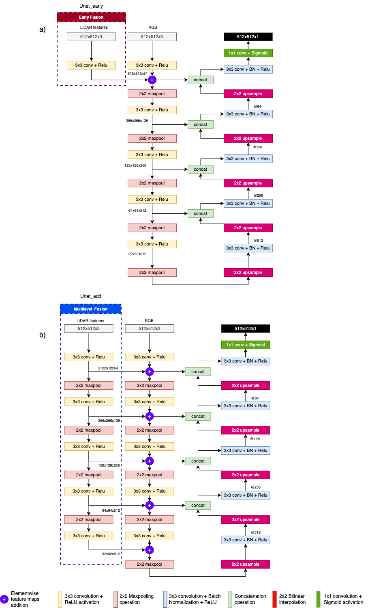

# Geoscience and Remote Sensing Letters, IEEE
# Deep Learning Multimodal Fusion for Road Network Extraction: Context and Contour improvement

## Architecture
[Unet Early and multilevel fusion - PDF](unet_add_fus_en2.pdf)

## Brazilian RGB and Surface Models images
[Dataset download](https://figshare.com/articles/dataset/Area01DF_surfacemodels/21504780)

## Code
The content will be publish soon.

